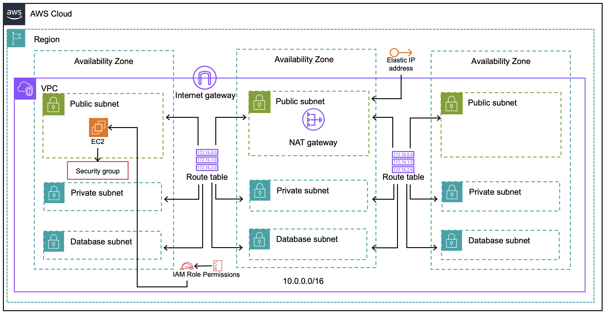

# Full Stack Web Application - Phase 4
In this section, we will learn how to build the basic Infrastructure

This phase includes

- Building Basic Infrastructure with Terraform on AWS
- Topics Covered
  - **Terraform** 
    - Concepts : Modularize the resources
    - Actions : All that followed in previous Phases
  - **Cloud** : AWS
    - Network Resources such as VPC, IGW, NGW, Route, RT, Subnet, Default SG
    - Storage Resources such as S3

For terraform basic tutorial : [Terraform Tutorial](infra/terraform/README.md)
For previous phases : [Project Phases](#project-phases) 

### Architecture
Following Architecture will be built on our Infrastructure


  
## Cloud Resources 
All the infrastructure related codes are present under the folder `infra` and IaC is under `terraform`
### 0. Pre-requisites
Before making the hands dirty, there are few things to understand about terraform code such as how to find appropriate resource?, what are all the attributes need? etc
- Always refer terraform documentation for any type of resources (implemenatation may differ terraform version to version)
- Once after the `Architecture` is signed off from the customer/architect, decide on TF version for the project and startup TF project folder structure (that we learnt in `Phase - 3`)
- Below coming explanation will make you to understand , how to write your first TF project with modules.


> **Let's Get Started**

 ### 1. Modules
In this section we are going to learn `Modules` in terraform and move the VPC resources to a module.

A **module** is a container for multiple resources that are used together. You can use modules to create lightweight abstractions, so that you can describe your infrastructure in terms of its architecture, rather than directly in terms of physical objects.

#### - Module Structure
A minimal recommended module following the standard structure is shown below.
```
$ tree minimal-module/
.
├── README.md
├── main.tf
├── variables.tf
├── outputs.tf
```
A complete example of a module following the standard structure is shown below.
```
$ tree complete-module/
.
├── README.md
├── main.tf
├── variables.tf
├── outputs.tf
├── ...
├── modules/
│   ├── nestedA/
│   │   ├── README.md
│   │   ├── variables.tf
│   │   ├── main.tf
│   │   ├── outputs.tf
│   ├── nestedB/
│   ├── .../
├── examples/
│   ├── exampleA/
│   │   ├── main.tf
│   ├── exampleB/
│   ├── .../
```

**Why are we going for a module concept ?**
- when the infrastructure as code grows high in volume and more repeated resources are being written then we have to organize and optimize them. So this is the reason to use `modules`

**What are those high volume and repeated resources mean ?**
- high volume ie, when we are at the end of our project we will be ending up by creating categories of resources such as Network, Compute, Database, Storage, IAM, etc. Ans each of this category has sereval resource so we are designing our IaC such a way theat we create abstracts for each category of resource
- repeated resources ie, we will be ending up creating multiple ec2 machine, iam roles, buckets etc. Inorder to not to repeat the `resource` and its dependent blocks everytime we need a same type of resource we are modularizing the resources

**How are we modularizing the resources?**
- as a first step we are going to modularize network resources ie grouping all the resources such as VPC, Subnet, Route Tables, Routes, EIP, to a module named `terraform-aws-vpc`
- follow along in the next setion for detailed walk through about setting up vpc module

### 2. VPC Module
In this section we are going to create a module for VPC.
Basically moving all the relavant `.tf` to a folder and calling them outside of that folder from another `.tf` is what known as modularization

- create a folder `modules`to isolate resources that are to be grouped as module
- create another folder named `terraform-aws-vpc` under `modules` folder
- now move all the `.tf` files that are belong to `network resources` such as `vpc.tf`, `subnet.tf`, `data.tf`,`variables.tf` , etc but not the `terraform.tf` file
- then in the parent folder ie `infra/terraform` create a `main.tf`, `variables.tf` file
- now declare the vpc module in `main.tf`
```dotnetcli
module "vpc" {
  source                 = "./modules/terraform-aws-vpc"
  cidr                   = var.vpc_cidr
  name                   = "${var.name}-${var.environment}"
  nat_per_az             = true
  separate_db_subnets    = true
  subnet_outer_offsets   = [ 3,3,3 ]
  subnet_inner_offsets   = [ 1,1 ]
  transit_gateway_attach = false
  transit_gateway_id     = ""
  allow_cidrs_default    = {}
  tags = var.tags

  public_subnet_tags = var.tags

  private_subnet_tags = var.tags
  environment = var.environment
}

```
- in the above snippet, we have declared our `vpc` module and the arguments needed to create the vpc resources
  - `source` - points to the path/location where the terraform module for vpc is located. This can be local, git refernce, s3, etc
  - remaining all the attributes holds the values for the variables that are defined in `modules/terraform-aws-vpc/variables.tf`
- terraform will recognise any module only by issuing `terraform init` command
- then as usual , terraform plan and apply to be executed from the folder `infra/terraform`

# Understood Modules , Correct !!!

# Now it is your turn to create a module for EC2, IAM and SG


 ### 3. Security Group
In this section we are going to write the module for Security Group. 

- This module must include
  - Security Group
  - Security Group Rules 
  
This security group module will be created before the EC2 resources are executed because EC2 machine needs `security groups id` as a mandatory field.

Using this module abstract, create a new module for SG on `main.tf`

  
 ### 4. IAM 
EC2 machine needs an instance profile which is nothing but an IAM role that needs to defined in a way that SSM connect from the browser must be enabled so that one can connect to the instance from the browser

- This module must include
  - IAM Role
  - IAM Policy
  - IAM Policy attachment
  
### 5. EC2
Create a module for EC2 that we are going to use it for deploying our `ems-demo` application

- This module must include
  - Instance profile
  - EC2 instance
  
Security Group Id, IAM role arn and AMI id must be passed to this module as inputs
  
### 6. Understand State
 #### - Look at the terraform state file created
 - `.terraform.tfstate` is the file that holds all the infrastructure details and metadata

 ### 7. Destroy All
 #### - Destroy the infrastructure
 - reun `terraform destroy` to destroy all the resources created by the terraform code.


### Project Phases
[Phase - 0 : Full Stack App Deployment (Manually)](https://github.com/jumisa/ems-ops/tree/phase-0)
[Phase - 1 : Full Stack App Deployment (Daemonize)](https://github.com/jumisa/ems-ops/tree/phase-1)
[Phase - 2 : Infrastructure by Terraform (Basics)](https://github.com/jumisa/ems-ops/tree/phase-2)
[Phase - 3 : Infrastructure by Terraform (Network Resource)](https://github.com/jumisa/ems-ops/tree/phase-3)