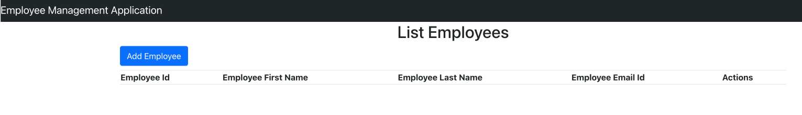
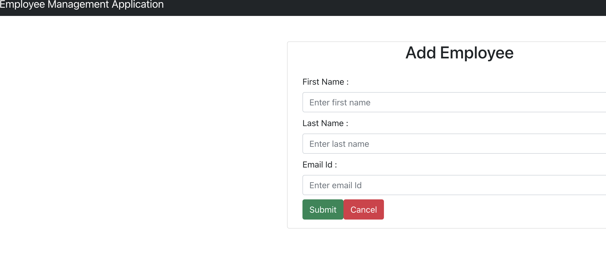

# Full Stack Web Application - Phase 0
In this section, we will learn how to build (ops) and deploy the web application developed by Dev Team.

This phase includes

- How to pull down a ReactJS Java code base, build and run it on local or ubuntu machine?
- Setup the end-to-end application manually & understand how does operations works

## Application Deep Dive
 ### 0. Pre-requisites
 #### Application Breakdown
Detailing of structure of Application

    * ReactJS Frontend
    * Java SpringBoot backend
    * MySQL RDBMS
  
 Following toolset/package to be installed as the first step
 ##### Tools
    * Java 17 
    * Maven 3.8.8
    * NodeJs 14.x
    * MySQL 8.x
 ##### Tools Installation (Ubuntu based)
  * Java
```
    sudo apt update
    sudo apt install openjdk-17-jdk openjdk-17-jre
```  
  * Maven 
    ```
        wget https://dlcdn.apache.org/maven/maven-3/3.8.8/binaries/apache-maven-3.8.8-bin.tar.gz
        tar -xvf apache-maven-3.8.8-bin.tar.gz
        mv apache-maven-3.8.8 /opt/
    ```
    * Maven M2_HOME Setup
      * Open the profile file `vim ~/.profile`  of the user and the following and save the file
      ```
          M2_HOME='/opt/apache-maven-3.8.8'
          PATH="$M2_HOME/bin:$PATH"
          export PATH
      ```
      * Verify the version of maven, it should be 3.8.8
      ```
          mvn -version    
      ```

  * NodeJs
    ```
        sudo apt update
        curl -sL https://deb.nodesource.com/setup_14.x | sudo bash -
        sudo apt -y install nodejs && npm
        node  -v && npm -v
    ```
        
  * MySQL
    * Install MySQL Server
    ```
        sudo apt update
        sudo apt install mysql-server
    ```
    * Update `root` user password
    ```
        sudo mysql
        ALTER USER 'root'@'localhost' IDENTIFIED WITH mysql_native_password BY 'password';
        exit
    ```
    * Configure User 
    ```
        sudo mysql -u root -p
        CREATE USER 'username'@'%' IDENTIFIED WITH mysql_native_password BY 'password';
        GRANT ALL PRIVILEGES ON *.* TO 'username'@'%' WITH GRANT OPTION;
        FLUSH PRIVILEGES;
        exit
    ```
    * Create Database
    ```
        sudo mysql -u username -p
        CREATE DATABASE databasename;
    ```
    
 ### 1. Backend Setup
 #### Code Base 
 - Java-SpringBoot Code placed under `springboot-backend`
 #### Update Application Properties
 - `application.properties` file under `springboot-backend/src/main/resources/application.properties` contains details of `DB` . Have to update the username , password that we have created above.
 #### Maven package init
 - `pom.xml` under the java project folder `springboot-backend` contains all the package and its dependencies, to install them all we use maven tool
 - `mvn clean ` must be executed from parent folder `springboot-backend` 
 #### Build the backend
 - Post the package installation is done , we have to build and package the application so that it can be executed as a process and serve the backend service 
  
 - `mvn install` is the command to build and package the application . This will generate a `target` folder under `springboot-backend`  and `*.jar` file will be generated
  
 - Generated `jar` file is the packaged application and that can be executed by `java` or any webservers like `tomcat` . By default the application runs on port `8080`
  
 #### Run the code  
- `java -jar apppppp.jar` , replace the `apppppp.jar` with the jar file gnerated in the previous step. This command executes the `jar` as process and in the console, once can see the status og speing boot application
 ### 2. Frontend Setup
 #### Code Base 
 - ReactJS Code placed under `react-hooks-frontend`
 #### Build the frontend application
 - `npm install` must be executed from parent folder `react-hooks-frontend` to get the packages and dependencies , store them under `node_modules` folder.
#### Run the Application
 - `npm start` must be executed from parent folder `react-hooks-frontend` to start the front end application. By default the application runs on port `3000` 

 ### 3. Accessing App in the Browser
 #### URL to access the Application
 ```
     http://localhost:3000/employees
 ```
#### Application Screenshots



