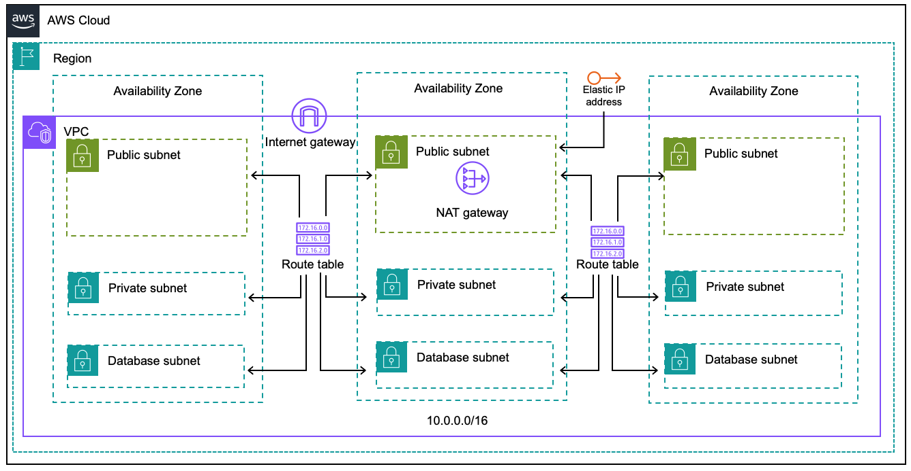

# Full Stack Web Application - Phase 2
In this section, we will learn how to build the basic Infrastructure

This phase includes

- Building Basic Infrastructure with Terraform on AWS
- Topics Covered
  - **Terraform** 
    - Concepts : Providers, Resources, Data Sources, Variables, Outputs, Locals
    - Actions : Profile setting, Initialisation, Creation, Modification, Destroying and State Management of Infrastructure
  - **Cloud** : AWS
    - Network Resources such as VPC, IGW, NGW, Route, RT, Subnet, Default SG

For terraform basic tutorial : [Terraform Tutorial](infra/terraform/README.md)
For previous phases : [Project Phases](#project-phases) 

### Architecture
Following Architecture will be built on our Infrastructure


  
## Cloud Resources 
All the infrastructure related codes are present under the folder `infra` and IaC is under `terraform`
### 0. Pre-requisites
Before making the hands dirty, there are few things to understand about terraform code such as how to find appropriate resource?, what are all the attributes need? etc
- Always refer terraform documentation for any type of resources (implemenatation may differ terraform version to version)
- Once after the `Architecture` is signed off from the customer/architect, decide on TF version for the project and startup TF project folder structure (that we learnt in `Phase - 2`)
- Below coming explanation will make you to understand , how to write your first TF project.


> **Let's Get Started**

 ### 1. VPC
In this section we are going to write the block for VPC resource.

As we have seen in the previous phase that all the items in terraform are bound as a block.

The following are the steps to write a block for AWS VPC and provision it
- create a file named `vpc.tf` under `infra/terraform`
- to define the resources that are to be created via terraform one can start refering the official documentation
- as we had setup our provider as `AWS` in the previous phase, here are the steps to land on correct documentation
  - browse the provider list from https://registry.terraform.io/browse/providers
  - then click on `AWS` , once the `AWS` provider page is opened then click on `Documentation` on the right. You willbe landing to https://registry.terraform.io/providers/hashicorp/aws/latest/docs
  
- this section details about, how do we create the AWS VPC using terraform
  - on the left filter search for VPC or scroll down to see the documentation for VPC
  - each section contains 2 sub-sections named `Resources` and `Data Sources`
  - all the `AWS` related resource or datasource will be prefixed/started with `aws_`
  - resource `aws_vpc` - provides a VPC resource
  - syntax of any resource will be like
  ```dotnetcli
    resource "RESOURCE_NAME" "name-of-this-block" {
  
    }
  ```
  - here `RESOURCE_NAME` will be `aws_vpc`
  - a resource block will be having `required` and `optional` arguments
  - to setup `aws_vpc` resource block we may need some arguments such as `cidr`, `tags` etc
  - here is how we defined our VPC resource block
  ```
    resource "aws_vpc" "main" {
      cidr_block           = var.cidr
      enable_dns_support   = true
      enable_dns_hostnames = true
    
      tags = merge(
        {
          Name        = "vpc.${var.name}"
          Environment = var.environment
        },
        var.tags
      )
    }
  ```
- other examples : https://registry.terraform.io/providers/hashicorp/aws/latest/docs/resources/vpc#example-usage
- arguments reference: https://registry.terraform.io/providers/hashicorp/aws/latest/docs/resources/vpc#argument-reference

# Fill out all the other blocks and fix the issues on code , variablize everything

 ### 2. Subnets
In this section we are going to write the block for Subnet resource. Process of landing to the resource in documentation is same as VPC (mentioned above)

- There are 3 subnets need in our architecture 
  - public
  - private 
  - database
  
 ### 3. Routes 
 Route Tables Routes and its association blocks to be created

- There are 3 resources need in our architecture 
  - public 
  - private 
  - database
  
### 4. Internet Gateway
### 5. Nat Gateway
### 6. EIP
### 7. Default Security Group
### 8. Understand State
 #### - Look at the terraform state file created
 - `.terraform.tfstate` is the file that holds all the infrastructure details and metadata

 ### 9. Destroy All
 #### - Destroy the infrastructure
 - reun `terraform destroy` to destroy all the resources created by the terraform code.


### Project Phases
[Phase - 0 : Full Stack App Deployment (Manually)](https://github.com/jumisa/ems-ops/tree/phase-0)
[Phase - 1 : Full Stack App Deployment (Daemonize)](https://github.com/jumisa/ems-ops/tree/phase-1)
[Phase - 2 : Infrastructure by Terraform (Basics)](https://github.com/jumisa/ems-ops/tree/phase-2)